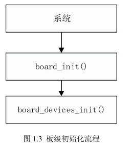
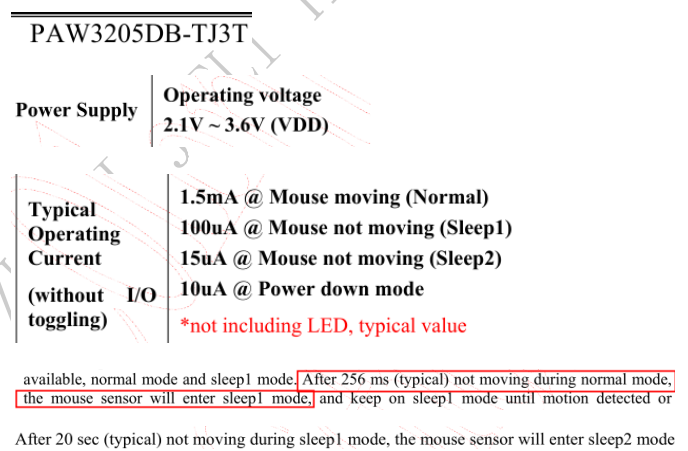
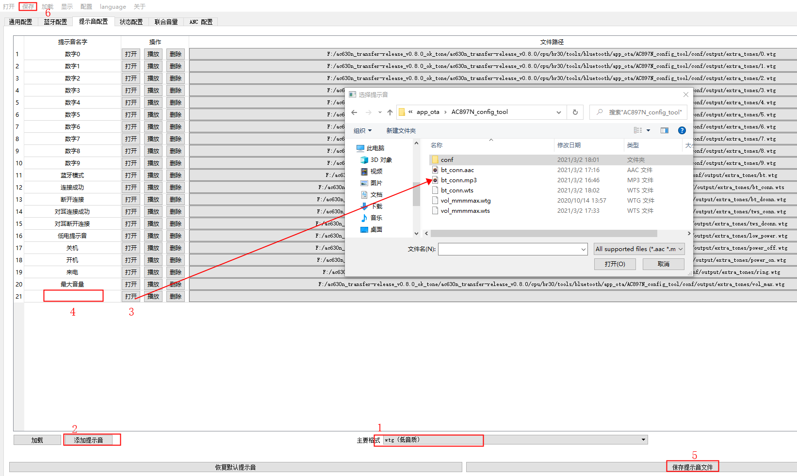

[icon_build]:./../../doc/stuff/build_passing.svg

# APP - Bluetooth: Dual-Mode HID ![Build result][icon_build]
---------------

代码工程：`apps\hid\board\bd29\AC631N_hid.cbp`

## 1.APP 概述
### 1.1 工程配置
* 板级配置选择

```C
#define CONFIG_BOARD_AC631N_DEMO       // CONFIG_APP_KEYBOARD,CONFIG_APP_PAGE_TURNER
// #define CONFIG_BOARD_AC6313_DEMO      // CONFIG_APP_KEYBOARD,CONFIG_APP_PAGE_TURNER
// #define CONFIG_BOARD_AC6302A_MOUSE  // CONFIG_APP_MOUSE
// #define CONFIG_BOARD_AC6319A_MOUSE  // CONFIG_APP_MOUSE
// #define CONFIG_BOARD_AC6318_DEMO     // CONFIG_APP_KEYFOB

```

* app case 选择,只选1,要配置对应的board_config.h
```C
#define CONFIG_APP_KEYBOARD                 0//hid按键 ,default case
#define CONFIG_APP_KEYFOB                   0//自拍器,  board_ac6368a,board_6318,board_6379b
#define CONFIG_APP_MOUSE                    1//mouse,   board_mouse
#define CONFIG_APP_STANDARD_KEYBOARD        0//标准HID键盘,board_ac6351d
#define CONFIG_APP_KEYPAGE                  0//翻页器
#define CONFIG_APP_GAMEBOX                  0//吃鸡王座
```
### 1.2.配置双模描述

* 配置双模使能配置
```C
 #define TCFG_USER_BLE_ENABLE 1 //BLE 功能使能
 #define TCFG_USER_EDR_ENABLE 1 //EDR 功能使能
```
* 支持双模以及2.4G模式切换处理,注意的是2.4G配对码必须和对方一致。

```C
//2.4G模式: 0---ble, 非0---2.4G配对码
/* #define CFG_RF_24G_CODE_ID       (0) //<=24bits */
#define CFG_RF_24G_CODE_ID       (0x23) //<=24bits
static void app_select_btmode(u8 mode)
{
    ...and so  on
    //os_time_dly(10);

    switch (bt_hid_mode) {
    case HID_MODE_BLE:
        log_info("---------app select ble--------\n");
        bt_24g_mode_set(0);
        bt_ble_mode_enable(1);
        break;
    case HID_MODE_EDR:
        log_info("---------app select edr--------\n");
        bt_edr_mode_enable(1);
        break;
    case HID_MODE_BLE_24G:
        log_info("---------app select 24g--------\n");
        bt_24g_mode_set(CFG_RF_24G_CODE_ID);
        bt_ble_mode_enable(1);

```


* 支持进入省电低功耗 Sleep
```C
//*********************************************************************************//
// 低功耗配置 //
//*********************************************************************************//
// #define TCFG_LOWPOWER_POWER_SEL PWR_DCDC15//
#define TCFG_LOWPOWER_POWER_SEL PWR_LDO15//
#define TCFG_LOWPOWER_BTOSC_DISABLE 0
#define TCFG_LOWPOWER_LOWPOWER_SEL SLEEP_EN
#define TCFG_LOWPOWER_VDDIOM_LEVEL VDDIOM_VOL_30V
#define TCFG_LOWPOWER_VDDIOW_LEVEL VDDIOW_VOL_24V
#define TCFG_LOWPOWER_OSC_TYPE OSC_TYPE_LRC
```
* 支持进入软关机，可用 IO 触发唤醒
```C
struct port_wakeup port0 = {
.pullup_down_enable = ENABLE, //配置 I/O 内部上下拉是否使能
.edge = FALLING_EDGE, //唤醒方式选择,可选：上升沿\下降沿
.attribute = BLUETOOTH_RESUME, //保留参数
.iomap = IO_PORTB_01, //唤醒口选择
.filter_enable = ENABLE,
};
static void hid_set_soft_poweroff(void)
{
log_info("hid_set_soft_poweroff\n");
is_hid_active = 1;
```
* 系统事件处理函数
```C
 static int event_handler(struct application *app, struct sys_event *event)
 {
```
### 1.3.经典蓝牙 EDR 模式的 HID 接口列表

#### 1.3.1 代码文件 `hid_user.c`

#### 1.3.2 接口说明

    user_hid_set_icon 配置显示的图标
    user_hid_set_ReportMap 配置描述符 report 表
    user_hid_init 模块初始化
    user_hid_exit 模块初退出
    user_hid_enable 模块开关使能
    user_hid_disconnect 断开连接
    user_hid_msg_handler 协议栈事件处理
    user_hid_send_data 发送数据接口
    user_hid_send_ok_callback 协议栈发送完成回调，用来触发继续发数


### 1.3.经典蓝牙 EDR 模式的 HID 接口列表

#### 1.3.1 代码文件 `le_hogp.c`
* hogp 的 profile 的数据表放在 le_hogp.h；用户可用工具 make_gatt_services 自定义修改,重新配置 GATT 服务和属性等。

#### 1.3.2 接口说明

    le_hogp_set_icon 配置显示图标
    le_hogp_set_ReportMap 配置描述符 report 表
    bt_ble_init 模块初始化
    bt_ble_exit 模块初退出
    ble_module_enable 模块开关使能
    ble_disconnect 断开连接
    cbk_packet_handler 协议栈事件处理
    cbk_sm_packet_handler 配对加密事件处理
    advertisements_setup_init 广播参数
    make_set_adv_data Adv 包数据组建
    make_set_rsp_data Rsp 包数据组建
    set_adv_enable 广播开关
    check_connetion_updata_deal 连接参数调整流程
    att_read_callback ATT 读事件处理
    att_write_callback ATT 写事件处理
    app_send_user_data 发送数据接口
    app_send_user_data_check 检查是否可以往协议栈发送数据
    can_send_now_wakeup 协议栈发送完成回调，用来触发继续发数

## 2.APP 目录结构

 * 以鼠标 APP_MOUSE 为例子，SDK 的目录结构如图 1.1 所示。
 

## 3.板级配置

### 3.1 板级方案配置
 * 为提高开发过程的灵活性，HID_SDK 为用户提供几种不同的板级方案，用户可根据具体的开发需求选择相应的方案。SDK
 在上一版的基础上基于BR23增加标准键盘的应用。
 * 板级方案配置文件的路径：apps/hid/board/BD29/board_config.h(hid 可替换为相应的 app 名称)。
 * 用户只需在板级方案配置文件 board_config.h 添加相应的宏定义，并包含相应的头文件，即可完成板级方案的配置。
```C
/*
 * 板级配置选择
*/
// #define CONFIG_BOARD_AC630X_DEMO
#define CONFIG_BOARD_AC6302A_MOUSE
// #define CONFIG_BOARD_AC6319A_MOUSE
// #define CONFIG_BOARD_AC6313_DEMO
// #define CONFIG_BOARD_AC6318_DEMO
```
### 3.2 板级配置文件
 * 板级配置文件的作用是实现相同系列不同封装的配置方案，其存放路径为：apps/hid/board/BD29(hid替换为相应的 app 名称)。板级配置文件对应一个 C 文件和一个 H 文件。
 * H 文件：板级配置的 H 文件包含了所有板载设备的配置信息，方便用户对具体的设备配置信息进行修改。
 * C 文件：板级配置的 C 文件的作用是根据 H 文件包含的板载配置信息，对板载设备进行初始化。

### 3.2 板级初始化

 - 系统将调用 C 文件中的 board_init()函数对板载设备进行初始化。板级初始化流程如图 1.3 所示。 用户可以根据开发需求在board_devices_init()函数中添加板载设备的初始化函数。

 

## 4.APP 开发框架

### 4.1 APP 总体框架

 - HID_SDK 为用户提供一种基于事件处理机制的 APP 开发框架，用户只需基于该框架添加需要处理的事件及事件处理函数，即可按照应用需求完成相应的开发。APP 总体框架如图 1.4 所示。
 

 * APP 状态机
系统在运行过程中，可以通过 APP 状态机对其状态进行切换，其状态包括创建、运行、挂起、删除。
 * APP 事件处理机
APP 是基于事件处理机制来运行的。系统在运行过程中，硬件设备的产生的数据将会以事件的形式反馈至系统的全局事件列表，系统将调度 APP 的事件处理机运行相应的事件处理函数对其进行处理。APP 的事件处理机的实现函数 apps/hid/app_mouse.c->event_handler()。处理流程如图1.5 所示。
 

## 5.按键的使用

### 5.1 IOKEY 的使用

 * 配置说明
 IOKEY 参数 在板 级配置 文件 中（C 文件 和 H 文件 ）进 行配置 ，在 H 文件 中可 以打开TCFG_IOKEY_ENABLE 宏和结构配置（IO口和按键连接方式）相关参数，配置结构体参数说明如表 2-1 所示。
 

 * 配置示例
IOKEY 参数在板级配置文件中（c 文件和 h 文件）进行配置，配置示例如表 2-2 所示。
 

### 5.2 ADKEY 的使用

 * 配置说明
 ADKEY参数在板级配置文件中（c文件和h文件）进行配置，如board_ac6xxx_mouse.c和board_ac6xxx_mouse_cfg.h，在h文件中可以打开TCFG_ADKEY_ENABLE宏和结构配置（IO口和按键连接方式）相关参数，配置结构体参数说明如表2-3所示。
 

 * 配置示例
 ADKEY参数在板级配置文件中（c文件和h文件）进行配置，配置示例如表2-4所示。
 

### 5.3 按键扫描参数配置
在IOKEY或者ADKEY使能后，按键扫描代码就会注册定时器定时扫描按键是否被按下，按键扫描参数可以在文件apps/common/key/iokey.c或adkey.c中配置，可供配置的参数表2-5所示。
 

### 5.4 按键事件处理
目前在HID_SDK中实现了的一些按键通用事件如表2-6所示。
 

按键发布消息后，在 APP 将会收到该消息，APP 可以根据该按键消息进行相关处理，APP 的event_handler 收到的按键消息数据格式如表 2-7 所示。用户可以根据收到的按键消息进行相关处理操作。
 

### 5.5 按键拓展功能
HID_SDK提供了一些通用按键配置和消息处理方式，如果这些通用的机制还不能满足用户的需求，用户可以通过修改配置使用按键的拓展功能。

 * 组合键功能
 HID_SDK的IOKEY中默认只支持单个按键的检测，用户如果需要支持组合按键，可以通过修改IOKEY的配置项来实现，具体实现如下：
  a、在配置文件的H文件中打开MULT_KEY_ENABLE宏，并添加组合键值。
  b、在配置文件的C文件中配置按键的重映射数据结构。
 配置示例如表2-8所示。
 

## 6.串口的使用
* 串口的初始化参数在板级配置文件中（c文件和h文件）进行配置，如board_ac6xxx_mouse.c和board_ac6xxx_mouse_cfg.h，在h文件中使能TCFG_UART0_ENABLE宏和结构配置相关参数，在C文件中添加初始化数据结构，配置示例如表2-9所示。串口初始化完成后，用户可调用apps/debug.c文件中的函数进行串口打印操作。
 

## 7.Mouse Report Map
* Mouse Report Map定义与apps/common/ble/le_hogp.c文件内，如图3.1所示。
```C
static const u8 hid_report_map[] = {
    0x05, 0x01, 0x09, 0x02, 0xA1, 0x01, 0x85, 0x01, 0x09, 0x01, 0xA1, 0x00, 0x95, 0x05, 0x75,
    0x01, 0x05, 0x09, 0x19, 0x01, 0x29, 0x05, 0x15, 0x00, 0x25, 0x01, 0x81, 0x02, 0x95, 0x01,
    0x75, 0x03, 0x81, 0x01, 0x75, 0x08, 0x95, 0x01, 0x05, 0x01, 0x09, 0x38, 0x15, 0x81, 0x25,
    0x7F, 0x81, 0x06, 0x05, 0x0C, 0x0A, 0x38, 0x02, 0x95, 0x01, 0x81, 0x06, 0xC0, 0x85, 0x02,
    0x09, 0x01, 0xA1, 0x00, 0x75, 0x0C, 0x95, 0x02, 0x05, 0x01, 0x09, 0x30, 0x09, 0x31, 0x16,
    0x01, 0xF8, 0x26, 0xFF, 0x07, 0x81, 0x06, 0xC0, 0xC0, 0x05, 0x0C, 0x09, 0x01, 0xA1, 0x01,
    0x85, 0x03, 0x15, 0x00, 0x25, 0x01, 0x75, 0x01, 0x95, 0x01, 0x09, 0xCD, 0x81, 0x06, 0x0A,
    0x83, 0x01, 0x81, 0x06, 0x09, 0xB5, 0x81, 0x06, 0x09, 0xB6, 0x81, 0x06, 0x09, 0xEA, 0x81,
    0x06, 0x09, 0xE9, 0x81, 0x06, 0x0A, 0x25, 0x02, 0x81, 0x06, 0x0A, 0x24, 0x02, 0x81, 0x06,
    0x09, 0x05, 0x15, 0x00, 0x26, 0xFF, 0x00, 0x75, 0x08, 0x95, 0x02, 0xB1, 0x02, 0xC0
};
```
Mouse Report Map 的解析可通过在线解析工具实现，用户可根据需要对 Report Map 进行修改。
Report Map 在线解析工具地址： http://eleccelerator.com/usbdescreqparser/。

## 8.蓝牙鼠标 APP 总体框架
蓝牙鼠标 APP 总体框架如图 4.2 所示。
 
* 在apps/hid/app_mouse.c文件中包含了APP的注册信息，如图3.3所示，系统在初始化过程中将根据此信息完成该APP的注册。

```C
/*
 * 注册AT Module模式
 */
REGISTER_APPLICATION(app_mouse) = {
    .name 	= "mouse",
    .action	= ACTION_MOUSE_MAIN,
    .ops 	= &app_mouse_ops,
    .state  = APP_STA_DESTROY,
};

```
* 系统初始化完成后，系统将调度app_task任务，该任务调用apps/hid/app_main.c->app_main()函数，开始运行app_mouse。
* 事件的产生
鼠标的按键、旋转编码开关、光学感应器的数据采集在系统软件定时器的中断服务函数中完成，采集的数据将被打包为相应的事件周期性地上报至全局事件列表。
* 事件的处理
系统将调度APP的事件处理机（app_mouse.c->event_handler()）依据事件类型，调用相应的事件处理函数。
app_key_event_handler()、app_code_sw_event_handler()、app_optical_sensor_event_handler()位于apps/hid/app_mouse.c文件，分别用以处理按键事件、旋转编码开关事件、光学感应器事件，其事件包含的数据将被填入mouse_packet_data中保存。
* 数据的发送
蓝牙设备初始化时，设置了一个系统的软件定时器，用以周期性地向蓝牙主设备发送mouse_packet_data数据，该系统定时器的中断服务函数为：
app/common/ble/le_hogp.c->hid_timer_mouse_handler()。


## 9.蓝牙鼠标功耗

 * 所用光学传感器资料
  

 * 测试条件
（1）ble连接状态下Interval：6*1.25 ms = 7.5ms，lantency：100。
（2）Radio TX:  7.2 dBm。
（3）DCDC；VDDIOM 3.0V；VDDIOW 2.4V。
（4）VDDIO和VBAT短接。

 * 芯片功耗
 

 * 整机功耗
 

## 10.OTA使用说明
### 10.1 概述

* 测试盒OTA升级介绍

  AC630N默认支持通过杰理蓝牙测试盒进行BLE或者EDR链路的OTA升级，方便客户在开发阶段对不方便有线升级的样机进行固件更新，或者在量产阶段进行批量升级。有关杰理蓝牙测试盒的使用及相关升级操作说明，详见文档“AC690x_1T2测试盒使用说明.pdf”。

* APP OTA升级介绍

 AC630N 可选支持APP OTA升级，SDK提供通过JL_RCSP协议与APP交互完成OTA的demo流程。客户可以直接参考JL_RCSP协议相关文档和手机APP OTA外接库说明，将APP OTA功能集成到客户自家APP中。APP OTA功能方便对已市场的产品进行远程固件推送升级，以此修复已知问题或支持新功能。

### 10.2 OTA-APP升级

* 1、SDK相关配置

  在app_config.h打开相关的宏定义：RCSP_BTMATE_EN、RCSP_UPDATE_EN

```C
//需要app(BLE)升级要开一下宏定义
#define RCSP_BTMATE_EN                    1
#define RCSP_UPDATE_EN                    1
#define UPDATE_MD5_ENABLE                 0
```
* 打开APP升级，需要修改ini的话需要在cpu\bd29\tools\bluetooth\app_ota下修改，如果未打开APP升级，则修改cpu\bd29\tools\bluetooth\standard下的ini配置。对应生成的升级文件ufw也在对应的目录下

* 2、手机端工具

2.1 安卓端开发说明：详见tools目录下Android_杰理OTA外接库开发说明      
2.2 IOS端开发说明： 详见tools目录下IOS_杰理OTA外接库开发说明

## 11. AUDIO功能
### 1. 概述
HID和SPP_AND_LE新添加了AUDIO的实现示例代码，需要使用AUDIO功能要使能TCFG_AUDIO_ENABLE。

目前支持芯片系列：AC635N、AC636N、AC673N


```C

//支持Audio功能，才能使能DAC/ADC模块
#ifdef CONFIG_LITE_AUDIO
#define TCFG_AUDIO_ENABLE					ENABLE
#if TCFG_AUDIO_ENABLE
#undef TCFG_AUDIO_ADC_ENABLE
#undef TCFG_AUDIO_DAC_ENABLE
#define TCFG_AUDIO_ADC_ENABLE				ENABLE_THIS_MOUDLE
#define TCFG_AUDIO_DAC_ENABLE				ENABLE_THIS_MOUDLE
```


### 2. AUDIO使用
* DAC硬件输出参数配置在板级配置文件里面有如下配置


```C
DAC硬件上的连接方式,可选的配置：
    DAC_OUTPUT_MONO_L               左声道
    DAC_OUTPUT_MONO_R               右声道
    DAC_OUTPUT_LR                   立体声
    DAC_OUTPUT_MONO_LR_DIFF         单声道差分输出
*/
#define TCFG_AUDIO_DAC_CONNECT_MODE        DAC_OUTPUT_MONO_LR_DIFF
```

### 3. MIC配置和使用
* 3.1 配置说明

  在每个board.c 文件里都有配置 mic 参数的结构体，如下所示：
  ```C
  struct adc_platform_data adc_data = {
  /*MIC 是否省隔直电容：0: 不省电容  1: 省电容 */
      .mic_capless    = TCFG_MIC_CAPLESS_ENABLE,
  /*差分mic使能,差分mic不能使用省电容模式*/
      .mic_diff    = 0,
  /*MIC LDO电流档位设置：0:5    1:10ua    2:15ua    3:20ua*/
      .mic_ldo_isel   = TCFG_AUDIO_ADC_LD0_SEL,
  /*MIC LDO电压档位设置,也会影响MIC的偏置电压0:1.5v  1:8v  2:2.1v  3:2.4v 4:2.7v 5:3.0 */
      .mic_ldo_vsel  = 3,
  /*MIC免电容方案需要设置，影响MIC的偏置电压
      21:1.18K    20:1.42K    19:1.55K    18:1.99K    17:2.2K     16:2.4K     15:2.6K     14:2.91K    13:3.05K    12:3.5K     11:3.73K
      10:3.91K    9:4.41K     8:5.0K      7:5.6K      6:6K        5:6.5K      4:7K        3:7.6K      2:8.0K      1:8.5K              */
      .mic_bias_res   = 18,
  /*MIC电容隔直模式使用内部mic偏置(PA2)*/
      .mic_bias_inside = 1,
  /*保持内部mic偏置(PA2)输出*/
      .mic_bias_keep = 0,

  /*MIC1 是否省隔直电容：0: 不省电容  1: 省电容 */
      .mic1_capless    = TCFG_MIC1_CAPLESS_ENABLE,
  /*差分mic使能,差分mic不能使用省电容模式*/
      .mic1_diff    = 0,
  /*MIC1 LDO电流档位设置：0:5    1:10ua    2:15ua    3:20ua*/
      .mic1_ldo_isel   = TCFG_AUDIO_ADC_LD0_SEL,
  /*MIC1 LDO电压档位设置,也会影响MIC的偏置电压0:1.5v  1:8v  2:2.1v  3:2.4v 4:2.7v 5:3.0 */
      .mic1_ldo_vsel  = 3,
  /*MIC1免电容方案需要设置，影响MIC的偏置电压
      21:1.18K    20:1.42K    19:1.55K    18:1.99K    17:2.2K     16:2.4K     15:2.6K     14:2.91K    13:3.05K    12:3.5K     11:3.73K
      10:3.91K    9:4.41K     8:5.0K      7:5.6K      6:6K        5:6.5K      4:7K        3:7.6K      2:8.0K      1:8.5K              */
      .mic1_bias_res   = 18,
  /*MIC1电容隔直模式使用内部mic偏置(PB7)*/
      .mic1_bias_inside = 1,
  /*保持内部mic偏置(PB7)输出*/
      .mic1_bias_keep = 0,

      // ladc 通道
      .ladc_num = ARRAY_SIZE(ladc_list),
      .ladc = ladc_list,
  };

  ```
* 主要关注以下变量：

1）mic_capless：0：选用不省电容模式 1：选用省电容模式

2）mic_bias_res：选用省电容模式的时候才有效，mic 的上拉偏置电阻，选择范围为：
1:16K 2:7.5K 3:5.1K 4:6.8K 5:4.7K 6:3.5K 7:2.9K 8:3K 9:2.5K 10:2.1K 11:1.9K 12:2K 13:1.8K 14:1.6K 15:1.5K 16:1K 31:0.6K

3）mic_ldo_vsel：mic_ldo 的偏置电压，与偏置电阻共同决定 mic 的偏置，选择范围为：0:2.3v 1:2.5v 2:2.7v 3:3.0v

4）mic_bias_inside：mic 外部电容隔直，芯片内部提供偏置电压，当 mic_bias_inside=1，可以正常使用 mic_bias_res 和 mic_ldo_vsel

* 3.2 自动校准 MIC 偏置电压

使用省电容模式时，可在 app_config.h 配置 TCFG_MC_BIAS_AUTO_ADJUST，选择 MIC 的自动校准模式，自动选择对应的MIC 偏置电阻和偏置电压。注意：不省电容无法校准。
```C
*省电容mic偏置电压自动调整(因为校准需要时间，所以有不同的方式) 
 *1、烧完程序（完全更新，包括配置区）开机校准一次 
 *2、上电复位的时候都校准,即断电重新上电就会校准是否有偏差(默认) 
 *3、每次开机都校准，不管有没有断过电，即校准流程每次都跑 
#define MC_BIAS_ADJUST_DISABLE      0   //省电容mic偏置校准关闭  
#define MC_BIAS_ADJUST_ONE          1   //省电容mic偏置只校准一次（跟dac trim一样）  
#define MC_BIAS_ADJUST_POWER_ON     2   //省电容mic偏置每次上电复位都校准(Power_On_Reset)  
#define MC_BIAS_ADJUST_ALWAYS       3   //省电容mic偏置每次开机都校准(包括上电复位和其他复位)  
#define TCFG_MC_BIAS_AUTO_ADJUST    MC_BIAS_ADJUST_POWER_ON  
#define TCFG_MC_CONVERGE_TRACE      0   //省电容mic收敛值跟踪  
```
* 3.3 Mic的使用示例

可调用audio_adc_open_demo(void)函数输出mic的声音，示例如下：
```C
if (key_type == KEY_EVENT_LONG && key_value == TCFG_ADKEY_VALUE0) {  
    printf(">>>key0:open mic\n");  
   //br23/25 mic test  
    extern int audio_adc_open_demo(void);  
    audio_adc_open_demo();  
    //br30 mic test  
    /* extern void audio_adc_mic_demo(u8 mic_idx, u8 gain, u8 mic_2_dac); */  
    /* audio_adc_mic_demo(1, 1, 1); */  
} 
```

### 4 提示音的使用
* 4.1 提示音文件配置

1.打开SDK对应的cpu\brxx\tools\bluetooth\app_ota\ACxxxN_config_tool，进入配置工具入口--->选择编译前配置工具--->提示音配置。


2.打开以上界面按步骤添加自己需要的*.mp3格式的源文件，转换成需要的主要格式。要注意文件的路径，SDK中默认的路径可能和本地保存的路径不同，要改成SDK当前的绝对路径。

3.在ota的目录download.bat下载项中添加tone.cfg配置选项。

4.播放sin\wtg提示音，要在板级配置文件里面使能TCFG_DEC_G729_ENABLE 和 TCFG_DEC_PCM_ENABLE两个宏，如下所示：
```C
#if TCFG_AUDIO_ENABLE
#undef TCFG_AUDIO_ADC_ENABLE
#undef TCFG_AUDIO_DAC_ENABLE
#define TCFG_AUDIO_ADC_ENABLE				ENABLE_THIS_MOUDLE
#define TCFG_AUDIO_DAC_ENABLE				ENABLE_THIS_MOUDLE
#define TCFG_DEC_SBC_CLOSE
#define TCFG_DEC_MSBC_CLOSE
#define TCFG_DEC_SBC_HWACCEL_CLOSE
#define TCFG_DEC_PCM_ENABLE                 ENABLE
#define TCFG_DEC_G729_ENABLE                ENABLE
```

*  4.2 提示音使用示例
可以调用tone_play()播放提示音，使用示例如下：
```C
if (key_type == KEY_EVENT_LONG && key_value == TCFG_ADKEY_VALUE2) {  
    printf(">>>key1:tone_play_test\n");  
    //br23/25 tone play test  
    /* tone_play_by_path(TONE_NORMAL, 1); */  
    /* tone_play_by_path(TONE_BT_CONN, 1); */  
    //br30 tone play test  
    tone_play(TONE_NUM_0, 1);  
    /* tone_play(TONE_SIN_NORMAL, 1); */  
} 
```
* 4.3 opus\speex编码的使用
1.配置说明

opus\speex编码模块是对mic的数据进行编码，使用给功能，需要在板级配置文件里面使能TCFG_ENC_OPUS_ENABLE和TCFG_ENC_SPEEX_ENABLE这两个宏，配置如下图所示:
```C
#if TCFG_AUDIO_ENABLE  
#undef TCFG_AUDIO_ADC_ENABLE  
#undef TCFG_AUDIO_DAC_ENABLE  
#define TCFG_AUDIO_ADC_ENABLE               ENABLE_THIS_MOUDLE  
#define TCFG_AUDIO_DAC_ENABLE               ENABLE_THIS_MOUDLE  
#define TCFG_DEC_G729_ENABLE                ENABLE  
#define TCFG_DEC_PCM_ENABLE                 ENABLE  
#define TCFG_ENC_OPUS_ENABLE                ENABLE  
#define TCFG_ENC_SPEEX_ENABLE               ENABLE  
#define TCFG_LINEIN_LR_CH                   AUDIO_LIN0_LR  
#else  
#define TCFG_DEC_PCM_ENABLE                 DISABLE  
#endif/*TCFG_AUDIO_ENABLE*/  
```
2. opus\speex编码示例

```C
int audio_mic_enc_open(int (*mic_output)(void *priv, void *buf, int len), u32 code_type);
```
对mic的数据进行opus\speex编码使用audio_mic_enc_open()函数，参数mic_output为编码后数据输出的函数，code_type为要进行编码的类型，可选AUDIO_CODING_OPUS和AUDIO_CODING_SPEEX，使用示例如下：

```C
/*encode test*/    
extern int audio_mic_enc_open(int (*mic_output)(void *priv, void *buf, int len), u32 code_type);    
audio_mic_enc_open(mic_enc_output_data, AUDIO_CODING_OPUS);//opus encode test    
/* audio_mic_enc_open(mic_enc_output_data, AUDIO_CODING_SPEEX);//speex encode test */  
```
